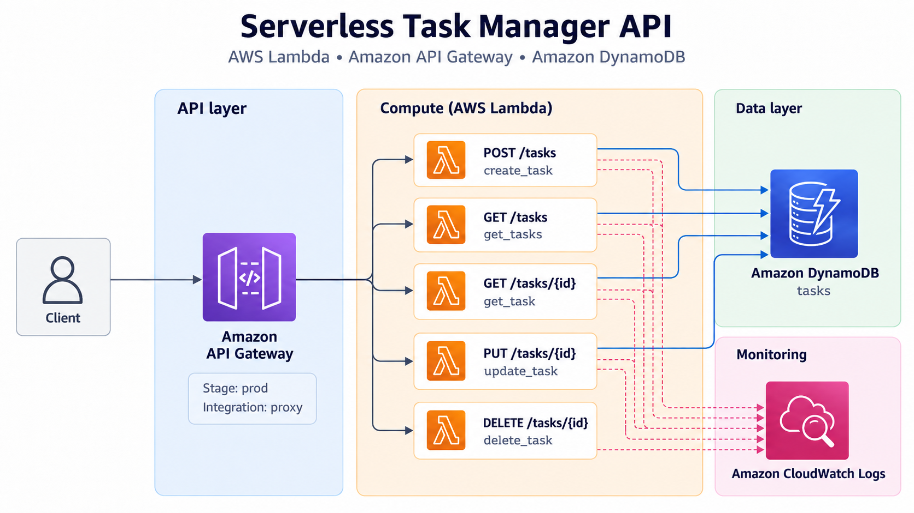
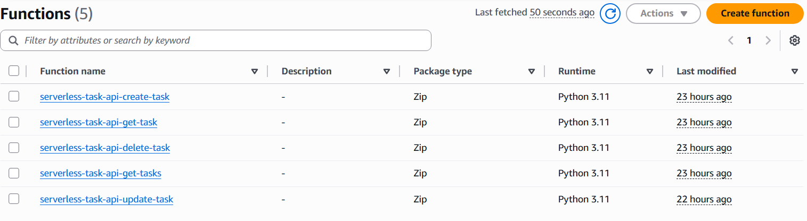
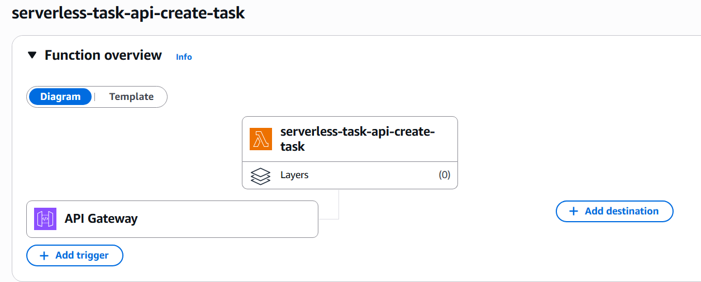
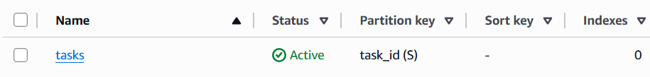
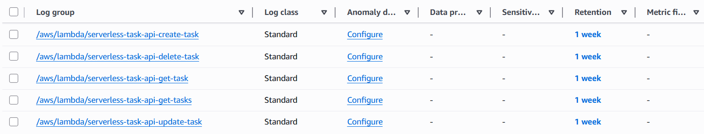
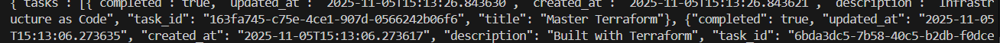

# Serverless Task Manager API

**One REST API, five Lambda functions, and no server to keep alive.**

I built this project to see what a small CRUD API looks like when the usual application server disappears from the picture.

API Gateway handles the HTTP surface. Each operation has its own Lambda function. DynamoDB holds the task data, and Terraform creates the stack from the API routes down to the IAM permissions and log groups.

This repository is the implementation record of that build — the code, infrastructure, and screenshots are here to show what I actually deployed and tested.

---

## The architecture

The runtime path is short:

`Client → API Gateway → Lambda → DynamoDB`

Each function also writes to CloudWatch Logs, while Terraform sits outside the request path and provisions the AWS resources.



There is no application server or container layer in between. API Gateway invokes the function responsible for the request, and that function talks directly to the table.

---

## I split the API by operation

Instead of one Lambda handling every route, I kept the five operations separate:

```text
POST   /tasks       → create_task
GET    /tasks       → get_tasks
GET    /tasks/{id}  → get_task
PUT    /tasks/{id}  → update_task
DELETE /tasks/{id}  → delete_task
```

That made the boundaries obvious while I was building the project. Each function has one job, its own deployment package, and its own CloudWatch log group.



The functions run on Python 3.11 and receive the DynamoDB table name through the `TABLE_NAME` environment variable rather than hardcoding it into the application code.

---

## The API Gateway handoff

API Gateway uses Lambda proxy integrations, so the request context is passed into the selected function and the Lambda response becomes the HTTP response.

The deployed API used a `prod` stage. I did not add an authentication layer to this experiment, so the methods in the Terraform configuration use `authorization = "NONE"`.



That boundary was one of the more useful parts of the project for me: the HTTP route and the function are separate resources, and Terraform has to wire the method, integration, invocation permission, deployment, and stage together correctly.

---

## State stayed simple

The task data lives in a single DynamoDB table using `task_id` as the partition key.

The table uses on-demand billing (`PAY_PER_REQUEST`), so there is no provisioned read or write capacity to manage for this small workload.



A task contains the generated ID, title, description, completion state, and timestamps. Creating a task generates a UUID; reads and updates use the path ID from API Gateway.

The collection endpoint uses a DynamoDB `Scan`. That was enough for this project, but I would not treat it as the query pattern for a large dataset.

---

## Terraform owned the stack

I kept the infrastructure split by responsibility rather than putting everything into one file:

```text
api_gateway.tf   API resources, methods, integrations and stage
dynamodb.tf      Tasks table
iam.tf           Lambda execution role and permissions
lambda.tf        Function packaging, functions and log groups
providers.tf     AWS provider
variables.tf     Region, environment and names
outputs.tf       API URL, API ID and table name
```

Terraform packages each Lambda directory into a ZIP, creates the functions, injects the table name, and attaches a shared role with access to the tasks table and CloudWatch logging.

The five Lambda log groups are also managed in Terraform with a seven-day retention period.



---

## The deployed API

The useful proof for this project was not another architecture diagram. It was getting a real response back through the full path after the stack was created.



At that point the request had crossed API Gateway, invoked the Lambda function, read from DynamoDB, and returned JSON to the client.

---

## What I took away from it

The code in each Lambda is small. The interesting part is the number of boundaries around that code.

A request route, an integration, an invocation permission, a function package, an IAM role, a table, and a log group all have to agree before one endpoint works. Serverless removed the server I would normally manage, but it did not remove infrastructure decisions.

> **No server to manage did not mean no infrastructure to reason about.**

---

## Repository map

```text
lambda/
├── create_task/
│   └── lambda_function.py
├── get_tasks/
│   └── lambda_function.py
├── get_task/
│   └── lambda_function.py
├── update_task/
│   └── lambda_function.py
└── delete_task/
    └── lambda_function.py

api_gateway.tf
dynamodb.tf
iam.tf
lambda.tf
providers.tf
variables.tf
outputs.tf

docs/images/
├── architecture.png
├── api-gateway-lambda-integration.png
├── cloudwatch-log-groups.png
├── dynamodb-tasks-table.png
├── lambda-functions.png
└── task-api-response.png
```

---

## A note on the current repository

This is a **portfolio record of the serverless API I built and deployed**, not a maintained production API.

I have left the original boundaries visible instead of retrofitting the project after the fact: there is no authentication layer, no automated test suite or CI pipeline in this repository, and the list operation still uses a DynamoDB `Scan`.

The point of keeping it public is the serverless design, the Terraform wiring, and the deployed result — not pretending the original project had pieces that were never there.
